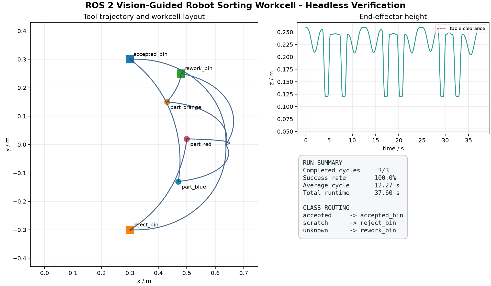

# PickSort-VLA 成果图册

[项目入口](../README.md) · [成果下载](https://github.com/1830051801-ux/picksort-vla/releases/tag/consolidation-20260920)

## 六轴语言条件分拣

保留原有 MuJoCo/Gymnasium、紧凑 VLA、动作块、时序输入、域随机化和回放工具。GIF 来自仓库已有的仿真专家演示；不是本轮新训练出来的策略，也不是真机视频。

## ROS 2 工作单元

本轮重新运行纯 Python 运动学演示：3 个物体分别进入合格、拒收和返工路线，完成 3/3；总仿真时间 37.60 s，平均单件 12.27 s。本轮没有启动 Gazebo 或 ROS 2 进程。

数据：[运行摘要](evidence/consolidation_20260920/run_summary.json)、[逐件结果](evidence/consolidation_20260920/cycles.csv)、[轨迹采样](evidence/consolidation_20260920/sampled_frames.json)。ROS 2/Gazebo 的历史回放记录随源码包一并提供。

## 本轮验证

| 范围 | 结果 |
| --- | --- |
| VLA 平台安全测试 | 57 通过；19 项慢测试或 MuJoCo 标记测试未在该命令运行 |
| 导入的工作单元测试 | 27 通过 |
| 发布结构与导入完整性 | 通过 |
| Ruff 检查与格式 | 通过 |
| 新的运动学演示 | 3/3 路由通过，PNG/GIF/JSON/CSV 已归档 |

## 现场功能验证（2026-09-22）

小U真实机械臂已完成运动闭环，并完成桌面物品抓取、桌面整理和垃圾清理，预设功能均已完成。示教位复现回传为 `9.375 s`、单段轨迹、最大关节误差约 `0.311°`。详见[现场能力回报](evidence/field_validation_20260922/README.md)。

配套机械 CAD、Pi/F407、六轴数字孪生和策略量化资产见 [小U主仓库](https://github.com/1830051801-ux/xiaou-vision-robot-arm)。
