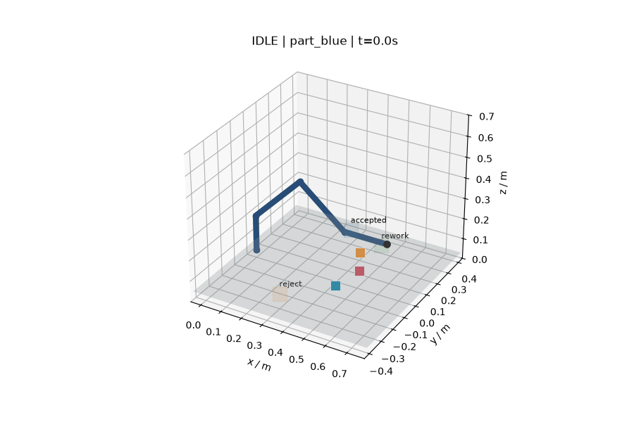
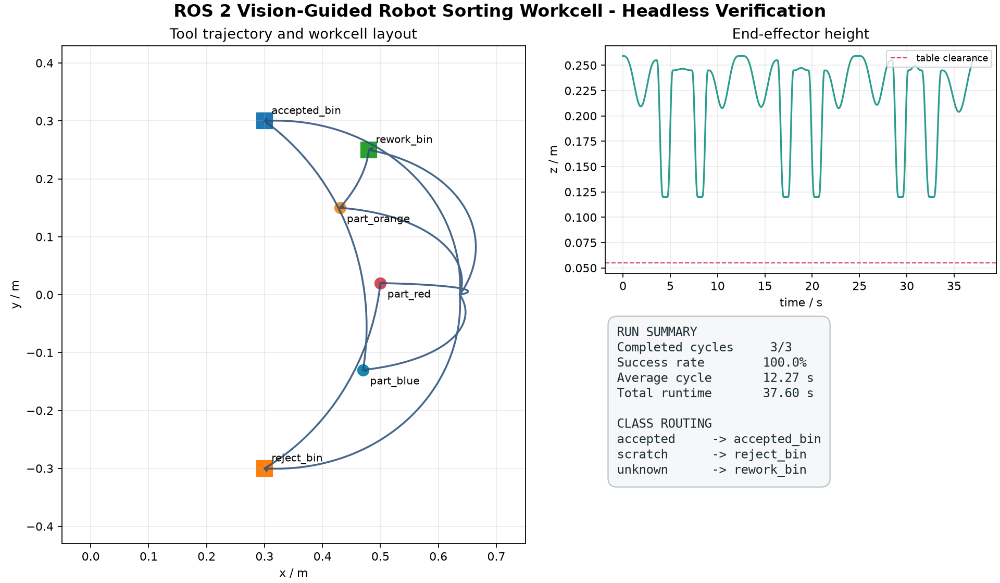

# ROS 2 Vision-Guided Robot Sorting Workcell

A ROS 2 Jazzy and Gazebo Harmonic reference workcell for camera-guided sorting.
The default pipeline segments blue, red and orange parts from the simulated RGB
camera, plans each pick, executes it through `ros2_control`, and checks measured
joint feedback before advancing the state machine.

> **Scope:** this repository demonstrates a deterministic simulation workflow.
> It is not evidence of physical-robot performance or a hardware safety system.

## Preview

_Pure-Python trajectory preview generated by `tools/run_headless_demo.py`; this
animation does not show the ROS 2 or Gazebo runtime._

## Quick start

With Ubuntu 24.04 WSL and the ROS dependencies already installed, run the full
camera-to-bin verification from Windows:

~~~powershell
powershell.exe -NoProfile -ExecutionPolicy Bypass -File .\tools\run_ros2_demo.ps1
~~~

The runner synchronizes and builds the WSL workspace, launches Gazebo without a
GUI, verifies the three routes, writes evidence under `results/`, and stops the
processes it started. See [Set up ROS 2 in WSL2](#set-up-ros-2-in-wsl2) for the
one-time installation.

## Reference run — 2026-07-15

_Deterministic core-planning dashboard; ROS 2 runtime evidence is linked below._

The repository is checked at three levels:

| Verification path | What it exercises | Reference result |
| --- | --- | ---: |
| Python tests | Kinematics, safety, trajectories, workflow, image processing, project contracts and Gazebo-pose parsing | 27 passed |
| Pure-Python headless demo | Deterministic planning and kinematic workflow; no ROS 2, controller or Gazebo physics | 3 / 3, 100%, 37.60 s simulated |
| ROS 2 end-to-end run | Gazebo camera, image processing, actions, measured feedback, attachment acknowledgement and queried model poses inside bin bounds | 3 / 3, all checks passed |

The recorded ROS 2 run used the default `perception:=color` path with Gazebo running server-only. It completed in 52.208 s wall time, received 585 camera frames and 10,587 joint-state messages, and measured these final Gazebo model positions:

| Part | Routed bin | Final position `[x, y, z]` m |
| --- | --- | --- |
| `part_blue` | `accepted_bin` | `[0.30000, 0.30000, 0.08550]` |
| `part_red` | `reject_bin` | `[0.30000, -0.30000, 0.08550]` |
| `part_orange` | `rework_bin` | `[0.48000, 0.25000, 0.08549]` |

Reference evidence includes the [machine-readable verification payload](docs/evidence/ros2_runtime_verification.json), [cycle metrics](docs/evidence/ros2_runtime_metrics.csv), [launch log](docs/evidence/ros2_runtime_launch.log) and [environment/run notes](docs/evidence/README.md).

## System components

| Area | Implementation |
| --- | --- |
| Perception | Gazebo `Image` + `CameraInfo`, HSV segmentation for blue/red/orange, workspace ROI filtering, pixel-to-`base_link` projection and multi-frame stability gating |
| Robot | Five controlled arm joints, parallel gripper, joint limits, collision and inertial model |
| Simulation | Gazebo Harmonic workbench, RGB camera, three workpieces and three collision-bin trays |
| Planning | Analytical Cartesian IK, guarded waypoints and velocity-limited quintic trajectories loaded from versioned cell configuration |
| Control | Dense multi-point `FollowJointTrajectory` action goals through `ros2_control` |
| Feedback | Action result checks plus fresh `/joint_states` target-error verification after every semantic segment |
| Grasp simulation | Gazebo `SetEntityPose` adapter; attach/detach status must be acknowledged before the coordinator advances |
| Safety | Confidence, frame, reach, height, lateral boundary, IK, joint-limit, controller and feedback checks |
| Metrics | One terminal record per object in a timestamped CSV, or a caller-selected path |
| Verification | Pure-Python tests/demo plus an independent live ROS 2 verifier that checks controllers, vision, feedback, terminal events and queried Gazebo bin poses |

## Runtime flow

~~~mermaid
flowchart LR
    A["Gazebo RGB camera"] --> B["HSV color perception"]
    B --> C["Stable DetectedObject in base_link"]
    C --> D["Safety + IK + trajectory planner"]
    D --> E["Pick coordinator"]
    E -->|"FollowJointTrajectory goal"| F["ros2_control"]
    F --> G["Gazebo arm and gripper"]
    G -->|"measured /joint_states"| E
    E -->|"attach / detach"| H["Gazebo attachment adapter"]
    H -->|"acknowledged status"| E
    H --> I["Gazebo workpiece pose"]
    E --> J["Cell status + CSV metrics"]
~~~

The default launch mode is image-based color perception. Synthetic detections remain available only as an explicit deterministic test mode:

~~~bash
ros2 launch sorting_cell_bringup sorting_cell.launch.py perception:=synthetic
~~~

The detector is calibrated for this controlled scene, not for general-purpose recognition.

## Repository layout

~~~text
src/
  sorting_cell_interfaces/   Detection and cell-status messages
  sorting_cell_description/  URDF/Xacro robot and control interfaces
  sorting_cell_gazebo/       Gazebo world and controller configuration
  sorting_cell_core/         Vision, IK, trajectory, safety, workflow and ROS nodes
  sorting_cell_bringup/      Sequenced launch file and RViz configuration
tools/                       Setup, build, run, checks and verification
docs/                        Architecture, interfaces, migration and evidence
results/                     Generated headless or ROS runtime artifacts
~~~

## Run the pure-Python checks

This path works on Windows without ROS 2. It validates the deterministic core, but it does not prove controller execution or Gazebo object motion.

~~~powershell
python -m pip install -r requirements-dev.txt
python tools/check_project.py
python -m pytest
python tools/run_headless_demo.py
~~~

The headless demo writes its JSON, CSV, sampled frames and visualizations under `results/`.

## Set up ROS 2 in WSL2

Tested configuration:

- Windows 11 with WSLg;
- Ubuntu 24.04 WSL distribution;
- ROS 2 Jazzy Jalisco;
- Gazebo Harmonic and `gz_ros2_control`.

If Ubuntu 24.04 is not installed yet, run this from the Windows repository and restart Windows when requested:

~~~powershell
powershell.exe -NoProfile -ExecutionPolicy Bypass -File .\tools\install_wsl.ps1
~~~

After the restart, this command copies the Windows source tree into the default WSL user's home directory, installs the ROS dependencies and builds all five packages:

~~~powershell
powershell.exe -NoProfile -ExecutionPolicy Bypass -File .\tools\setup_wsl_after_reboot.ps1
~~~

For later source synchronizations and rebuilds, skip the ROS installation step:

~~~powershell
powershell.exe -NoProfile -ExecutionPolicy Bypass -File .\tools\setup_wsl_after_reboot.ps1 -SkipRosInstall
~~~

The default WSL project path is `~/ros2-vision-guided-sorting-cell`. Override `-Distro`, `-LinuxUser` or `-LinuxProjectDir` when your environment differs.

To build directly inside WSL:

~~~bash
cd ~/ros2-vision-guided-sorting-cell
./tools/build_ros2.sh
source install/setup.bash
~~~

## Run, verify and stop the ROS 2 workcell

The Windows convenience runner synchronizes/builds the WSL copy, launches the cell, starts the live verifier before the cycles complete, collects logs/metrics/evidence, and stops every process it started:

~~~powershell
powershell.exe -NoProfile -ExecutionPolicy Bypass -File .\tools\run_ros2_demo.ps1
~~~

Use `-SkipSyncBuild` to reuse an already synchronized workspace, `-TimeoutSeconds` to change the verification deadline and `-OutputDir` to select a Windows evidence directory.

The Linux/WSL entry point is:

~~~bash
cd ~/ros2-vision-guided-sorting-cell
bash tools/run_ros2_demo.sh
~~~

The Linux runner builds by default. It accepts `--skip-build`, `--timeout` and `--output-dir`, and uses Xvfb with software rendering when no display is available. Each runner creates `results/ros2-runtime-<UTC timestamp>/` containing `verification.json`, `launch.log`, `verifier.log` and `metrics.csv` unless an output directory is supplied.

For an interactive WSLg session, launch manually:

~~~bash
cd ~/ros2-vision-guided-sorting-cell
source /opt/ros/jazzy/setup.bash
source install/setup.bash
ros2 launch sorting_cell_bringup sorting_cell.launch.py
~~~

In a second sourced WSL terminal, verify the running system:

~~~bash
cd ~/ros2-vision-guided-sorting-cell
source /opt/ros/jazzy/setup.bash
source install/setup.bash
python3 tools/verify_ros2_demo.py \
  --timeout 240 \
  --output /tmp/ros2_runtime_verification.json
~~~

Start the verifier before the three cycles finish so it can observe the camera and detections. Stop a manual launch with `Ctrl+C` in its launch terminal.

For a server-only run without Gazebo or RViz windows:

~~~bash
ros2 launch sorting_cell_bringup sorting_cell.launch.py gazebo_gui:=false rviz:=false
~~~

## Launch arguments

| Argument | Default | Meaning |
| --- | --- | --- |
| `perception` | `color` | `color` consumes camera images; `synthetic` is the explicit pose-source test mode |
| `gazebo_gui` | `true` | Start the Gazebo GUI; set `false` for server-only or CI runs |
| `rviz` | `true` | Start RViz2 with the supplied workcell configuration |
| `metrics_csv` | empty | Exact CSV path; empty creates `/tmp/sorting_cell_metrics_<UTC timestamp>.csv` |
| `spawn_delay` | `3.0` | Seconds to wait for Gazebo world services before spawning the robot |

## Useful inspection commands

~~~bash
ros2 node list
ros2 control list_controllers
ros2 action info /cell_controller/follow_joint_trajectory
ros2 topic echo /sorting_cell/status
ros2 topic echo /sorting_cell/detections
ros2 topic echo /sorting_cell/attachment_status
ros2 topic hz /joint_states
ros2 topic hz /sorting_cell/camera/image_raw
~~~

## Hardware porting

A hardware port should retain the `DetectedObject` contract, the
`FollowJointTrajectory` action boundary, measured joint feedback, gripper
acknowledgement and `CellStatus` reporting. Force-controlled grasping, obstacle
planning and safety-rated interlocks are outside this simulator project. See
[`docs/ARCHITECTURE.md`](docs/ARCHITECTURE.md),
[`docs/INTERFACES.md`](docs/INTERFACES.md) and
[`docs/REAL_ROBOT_MIGRATION.md`](docs/REAL_ROBOT_MIGRATION.md).

## License

[MIT](LICENSE). Release notes are in [CHANGELOG.md](CHANGELOG.md), and citation
metadata is available in [CITATION.cff](CITATION.cff).
